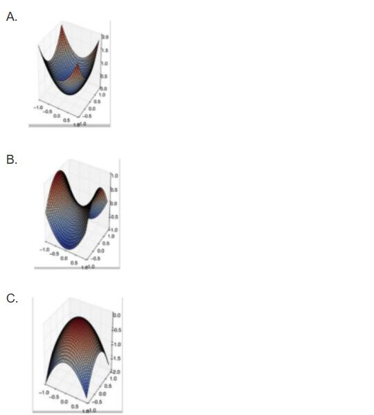

# 21-22 春学期《人工智能与机器学习》回忆卷（自动化班）

> 回忆卷，部分题目凭记忆复述；对于不完整题干，已根据本仓库笔记做了最可能的补全，补全处以 *[补全]* 标注。

## 一、选择题（20 题）

1. 人工智能的定义是什么？ *[补全]*
2. $k$ 折交叉验证（$k$-fold cross validation）的基本做法是？ *[补全]*
3. 朴素贝叶斯分类器的前提假设是什么？ *[补全]*（即"给定类别的条件下，各特征相互独立"）
4. 使用朴素贝叶斯分类器时，若将某个特征重复输入，对分类结果会有什么影响？ *[补全]*
5. 有监督学习与无监督学习的区别是什么？ *[补全]*
6. 下列哪一项不是常用的激活函数？ *[补全]*（候选：Sigmoid / Tanh / ReLU / 均方误差等）
7. 深度优先搜索（DFS）通常使用什么数据结构实现？ *[补全]*（栈 / 队列 / 堆 / 链表）
8. 信息增益的计算公式是？ *[补全]*（$\mathrm{Gain}(D,a) = \mathrm{Ent}(D) - \sum_v \frac{|D^v|}{|D|}\mathrm{Ent}(D^v)$）
9. 下列关于命题逻辑的说法正确的是？ *[补全]*
10. 二分类、多分类、回归和聚类四类任务的区别是什么？ *[补全]*
11. 下列哪些情况会使梯度下降算法"卡住"（陷入停滞）？（题目附三幅 3D 曲面图，分别对应局部极小、鞍点、局部极大）

    

    A. 碗状曲面（局部极小）
    B. 鞍点
    C. 倒碗状曲面（局部极大）

    > 参考答案倾向 B（鞍点最易卡住）；C 处梯度不稳定，A 处恰为收敛目标。

## 二、填空题（20 空）

1. 智能包含的四种能力是 ________、________、________、________。
2. 人工智能的短期目标是 ________，终极目标是 ________。
3. 设 $P$ 为原子谓词公式，则 $P$ 与 $\lnot P$ 互为 ________。
4. Find-S 使用 ________ 序（由特殊到一般）的方法，在 ________ 结构（偏序/假设空间）上实现，每一步得到的假设都是在该点上与训练样例一致的 ________ 假设（极大特殊）。
5. 若 $P, R$ 为假，$Q$ 为真，则 $(P \lor R) \to Q$ 的真值为 ________。
6. $\mathrm{Teacher}(\mathrm{Father}(\mathrm{Zhan}))$ 的个体（项）是 ________。

## 三、大题（5 道）

1. **博弈搜索与 $\alpha$-$\beta$ 剪枝**：给定博弈树，计算各节点的倒推值，说明 $\alpha$-$\beta$ 剪枝原理，并标出应剪去的分支。
2. **A\* 搜索**：$A^*$ 搜索中 $g(n)$ 与 $h(n)$ 分别表示什么？写出 $f(n)$ 的定义并说明 $h(n)$ 可容许（admissible）与一致（consistent）的含义。
3. **归结推理**：赵、钱、孙、李四人中有人偷了东西。已知：
   - A 说：赵和钱中必有一人偷了；
   - B 说：钱和孙中必有一人偷了；
   - C 说：孙和李中必有一人偷了；
   - D 说：赵和孙中必有一人没偷；
   - E 说：钱和李中必有一人没偷。
   
   使用归结反演证明小偷是谁。
4. **过拟合与欠拟合**：分别给出定义，分析造成过拟合的主要原因，并说明在 *决策树* 和 *神经网络* 中分别用何种方法避免过拟合。
5. **评价指标**：写出常用的回归与分类评估指标，并分别说明其优缺点。
